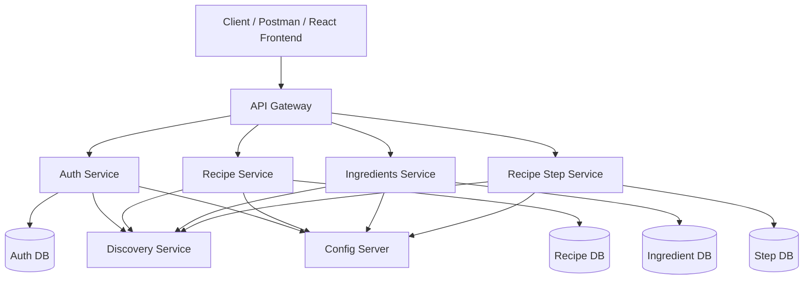

# 🍲 Recipes Microservices Platform (Spring Boot + Spring Cloud)

This project is a **Spring Boot microservices-based backend system** designed for managing recipes, ingredients, and user-generated cooking data in a scalable and modular architecture.

The system is built using **Spring Cloud components** and follows modern distributed system principles, including service separation, centralized configuration, API Gateway routing, and service discovery.

Each microservice is responsible for a specific domain, such as recipes, ingredients, authentication, or recipe steps, ensuring high cohesion and low coupling across the system.

The platform supports secure authentication using **JWT-based security**, role-based access control (USER / ADMIN), and inter-service communication via **OpenFeign**.

The architecture is designed to simulate a real production environment, focusing on scalability, maintainability, and clean separation of concerns.

---

## 📌 Overview

This project is a **microservices-based backend platform** designed to demonstrate a real-world distributed system architecture.

It includes:
- Authentication & authorization (JWT-based)
- API Gateway routing
- Service discovery
- Centralized configuration
- Domain-driven microservices
- Secure inter-service communication

---

## 🧱 Architecture

The system consists of the following microservices:

### 🔐 Auth Service
- User registration and login
- JWT token generation
- User profile endpoints

## 🧱 Architecture Diagram

### 👤 User Management (Auth domain)
- User details retrieval
- Role management (USER / ADMIN)
- User update & deletion

### 🍽️ Recipe Service
- Recipe CRUD operations
- Filtering by category and author
- Recipe ownership handling

### 🧂 Recipe Ingredient Service
- Manages ingredients assigned to recipes
- Validates ingredient usage

### 🪜 Recipe Step Service
- Manages step-by-step recipe instructions
- Supports ordering and bulk deletion per recipe

### 🥕 Ingredients Service
- Ingredient CRUD operations
- Category-based ingredient grouping
- Pagination and search support

### 🏷️ Ingredient Categories Service
- Ingredient categorization management

### ⚙️ Config Server
- Centralized configuration for all services

### 🔍 Discovery Service (Eureka / Consul)
- Service registry for dynamic service discovery

### 🌐 API Gateway
- Single entry point for all external requests
- Routes traffic to appropriate microservices
- Handles cross-cutting concerns

---

## 🛠️ Tech Stack

- Java 21
- Spring Boot
- Spring Cloud
  - Config Server
  - Eureka / Discovery
  - OpenFeign
  - API Gateway
- Spring Security (JWT + Role-based access control)
- Spring Data JPA
- Hibernate
- PostgreSQL
- Maven

---

## 🔒 Security

- JWT-based authentication
- Role-based authorization:
  - USER
  - ADMIN
- Method-level security using @PreAuthorize
- API Gateway as single entry point
- Secure inter-service communication

---

## 📡 System Communication

- API Gateway routes all external requests
- Services register in Discovery Service
- OpenFeign used for inter-service communication
- Config Server provides centralized configuration
- JWT used across services for authentication context

---

## 🧪 Testing Strategy

The project follows a multi-layer testing approach to ensure reliability and clean architecture.

### 🔹 Controller Tests (`@WebMvcTest`)
- Uses MockMvc for HTTP request simulation
- Mockito used to mock service layer
- Validates:
  - HTTP status codes
  - JSON responses
  - Request validation
  - Security filters (disabled in unit tests)

### 🔹 Service Tests (`Mockito Unit Tests`)
- Isolated business logic testing
- Repository layer is mocked
- Focus on:
  - Core logic validation
  - Exception handling
  - Data transformations

### 🔹 Repository Tests (`@DataJpaTest`)
- Uses Spring Data JPA test slice
- Runs against in-memory database
- Validates:
  - Query methods
  - Persistence logic
  - Database constraints

---

### 🧠 Tools Used

- JUnit 5
- Mockito
- MockMvc
- Spring Boot Test
- Spring Data JPA Test

## 🚀 Features

- Microservices architecture
- API Gateway pattern
- Service discovery (Eureka / Consul)
- Centralized configuration management
- JWT authentication & authorization
- Role-based access control
- Domain separation:
  - Recipes
  - Ingredients
  - Recipe Steps
  - Users
- Database-per-service design
- Pagination & filtering support
- RESTful API design

---

## 🌐 API Overview

All endpoints are exposed through the **API Gateway**.

---

### 🔐 Auth Service (`/api/auth`)
- POST /signup → Register user
- POST /login → Authenticate user
- GET /profile → Get current user
- GET /profile-id-role → Get user ID and role

---

### 👤 User Service (`/users`)
- GET /me → Current user
- GET / → All users *(ADMIN)*
- GET /{id} → Get user by ID
- PUT /role/{id} → Update role *(ADMIN)*
- PUT /{id} → Update user
- DELETE /{id} → Delete user

---

### 🥕 Ingredients (`/api/ingredients`)
- POST / → Create ingredient
- GET / → List ingredients (paginated)
- GET /{id} → Get ingredient
- GET /with-categories/{id} → Ingredient with category
- GET /by-category/{id} → Filter by category
- GET /by-name/{name} → Search ingredients
- GET /exists/{id} → Check existence
- PUT /{id} → Update ingredient *(ADMIN)*
- DELETE /{id} → Delete ingredient *(ADMIN)*

---

### 🏷️ Ingredient Categories (`/api/ingredient-categories`)
- POST / → Create category *(ADMIN)*
- GET / → Get categories
- GET /{id} → Get category
- PUT /{id} → Update category *(ADMIN)*
- DELETE /{id} → Delete category *(ADMIN)*

---

### 🍽️ Recipes (`/api/recipes`)
- POST / → Create recipe
- GET / → List recipes (paginated)
- GET /{id} → Get recipe
- GET /owner-id/{id} → Get owner
- GET /author-recipes/{userId} → Recipes by user
- GET /by-category/{id} → Filter by category
- GET /exists/{id} → Check existence
- PUT /{id} → Update recipe
- DELETE /{id} → Delete recipe

---

### 🧂 Recipe Ingredients (`/api/recipe-ingredients`)
- POST / → Add ingredient to recipe
- GET / → Get all recipe ingredients
- PUT /{id} → Update
- DELETE /{id} → Delete
- GET /ingredient-id-exists/{id} → Check usage

---

### 🪜 Recipe Steps (`/api/recipe-steps`)
- POST / → Create step
- GET /recipe/{recipeId} → Get steps
- PUT /{id} → Update step
- DELETE /{id} → Delete step
- DELETE /delete-all/{recipeId} → Remove all steps

---

## ▶️ Getting Started

### 1. Clone repository
bash
git clone https://github.com/cstefanakis/recipes-spring-boot-microservices.git
cd recipes-spring-boot-microservices

### 2. Set up PostgreSQL databases
Make sure PostgreSQL is running and create the required databases:
CREATE DATABASE ingredients;
CREATE DATABASE recipes;
CREATE DATABASE recipe_steps;

Update your credentials if needed in each service configuration:

### 2. Build all services
mvn clean install

### 3. Run services in orderConfig Server
1. PostgreSQL (must be running first)
2. Config Server
3. Discovery Service
4. API Gateway
5. Auth Service
6. Ingredients Service
7. Recipe Service
8. Recipe Step Service

Future Improvements
- 🌐 Frontend application using **React**
  - User-friendly UI for browsing recipes and ingredients
  - Recipe creation and editing interface
  - Authentication flow (login/register with JWT)
  - Role-based UI (USER / ADMIN views)
  - Recipe step-by-step visualization
  - Ingredient filtering and search
- 🐳 Docker & Docker Compose setup for all services
- ⚙️ CI/CD pipeline (GitHub Actions)

👤 Author

Christos Stefanakis
